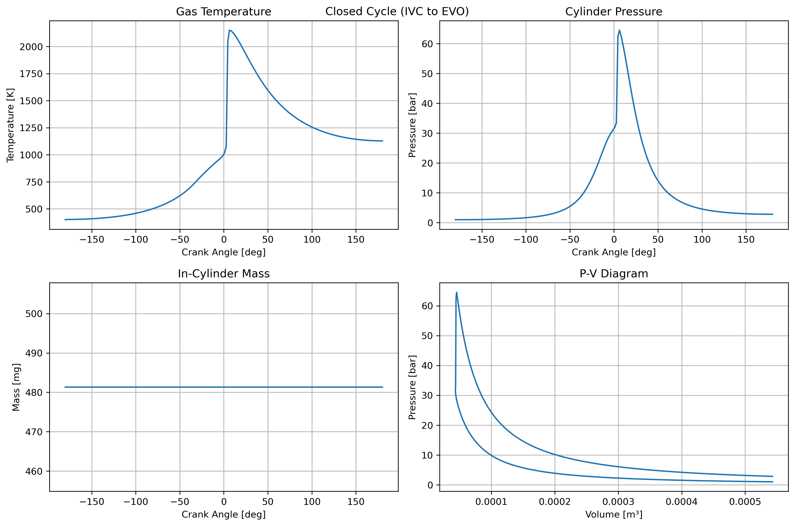

# 0D Engine Simulator

A zero-dimensional (0D) engine simulator for modeling closed-cycle operation with detailed chemical kinetics. The simulator uses a reduced iso-octane mechanism developed by Nissan [1] for efficient yet accurate combustion predictions.

## Features

- Closed-cycle engine simulation (IVC to EVO)
- Detailed chemical kinetics using Cantera
- Woschni heat transfer model
- EGR handling with equilibrium composition
- Interactive plotting of results

## Project Structure

```
.
├── src/               # Core simulation code
│   ├── engine/       # Engine geometry and heat transfer
│   ├── models/       # Physical models (chemistry, etc.)
│   ├── simulation/   # Solver and simulation code
│   └── config/       # Configuration files
├── scripts/          # Runnable scripts
├── data/             # Data files
│   ├── input/        # Input data files
│   ├── mechanisms/   # Reaction mechanisms
│   └── output/       # Simulation results
├── tests/            # Test files
└── docs/             # Documentation
```

## Requirements

- Python 3.8+
- Cantera 2.6+
- NumPy
- SciPy
- Matplotlib
- PyYAML

## Quick Start

1. Install dependencies:
```bash
pip install cantera numpy scipy matplotlib pyyaml
```

2. Run simulation:
```bash
python scripts/run_simulation.py
```

The simulation results will be saved in `data/output/`.

## Configuration

Engine and simulation parameters can be modified in `src/config/default_config.yaml`:

- Engine geometry (bore, stroke, compression ratio)
- Operating conditions (speed, initial temperature/pressure)
- Mixture composition (fuel, equivalence ratio, EGR fraction)
- Solver settings (tolerances, step sizes)

## References

[1] T. Tsurushima, "A new skeletal PRF kinetic model for HCCI combustion," Proceedings of the Combustion Institute, vol. 32, no. 2, pp. 2835-2841, 2009. [DOI: 10.1016/j.proci.2008.06.018](https://doi.org/10.1016/j.proci.2008.06.018)

## Sample Results



The figure shows typical simulation results for a closed-cycle HCCI simulation from IVC (-180°) to EVO (180°):

**Top Left: Gas Temperature**
- Initial temperature at IVC: 450 K
- Compression heating up to ~1000 K
- Rapid temperature rise due to auto-ignition around TDC
- Peak temperature ~2100 K
- Expansion cooling after combustion

**Top Right: Cylinder Pressure**
- Initial pressure at IVC: 1.0 bar
- Compression to ~30 bar
- Sharp pressure rise from combustion
- Peak pressure ~65 bar
- Expansion back to ~3 bar at EVO

**Bottom Left: In-Cylinder Mass**
- Constant mass during closed cycle (~480 mg)
- Validates mass conservation
- No flow across boundaries (closed valves)

**Bottom Right: P-V Diagram**
- Clockwise loop indicating positive work
- Compression from right to left
- Combustion at minimum volume
- Expansion from left to right
- Area represents net work output

The results demonstrate key HCCI characteristics:
- Rapid, simultaneous auto-ignition near TDC
- High peak pressure rise rate
- Short combustion duration
- Significant heat release during constant volume

## Model Formulation

### Key Assumptions
- Uniform temperature across the cylinder (single-zone model)
- Uniform composition and instantaneous mixing (perfect mixing)
- Uniform heat transfer across cylinder walls
- Ideal gas behavior
- No crevice effects
- No blow-by losses

### Governing Equations

The model solves the following conservation equations for a reacting variable volume system:

1. **Mass Conservation**
   ```
   dm/dt = Σ ṁⱼ
   ```
   where:
   - m = total mass in cylinder
   - ṁⱼ = mass flow rates (intake, exhaust, fuel injection)
   - For closed cycle: dm/dt = 0

2. **Species Conservation**
   ```
   dYₖ/dt = Σⱼ (ṁⱼ/m)(Yₖʲ - Yₖᶜʸˡ) + (ΩₖWₖ)/ρ
   ```
   where:
   - Yₖ = mass fraction of species k
   - Yₖʲ = mass fraction of species k in flow j
   - Yₖᶜʸˡ = mass fraction of species k in cylinder
   - Ωₖ = molar production rate of species k
   - Wₖ = molecular weight of species k
   - ρ = gas density

3. **Energy Conservation**
   ```
   dT/dt = (1/mCᵥ)[-p(dv/dt) - m Σₖ uₖ(dYₖ/dt) - (dm/dt)ū - Qw + Σⱼ ṁⱼhⱼ]
   ```
   where:
   - T = temperature
   - Cᵥ = specific heat at constant volume
   - p = pressure
   - v = specific volume
   - uₖ = specific internal energy of species k
   - ū = average specific internal energy
   - Qw = wall heat transfer rate
   - hⱼ = specific enthalpy of flow j

4. **Pressure Evolution** (from ideal gas law)
   ```
   dP/dt = P[(Σᵢ Rᵢ(dYᵢ/dt)/R) + (ṁ/m) + (Ṫ/T) - (V̇/V)]
   ```
   where:
   - P = pressure
   - Rᵢ = specific gas constant of species i
   - R = mixture gas constant
   - V = volume
   - Dots represent time derivatives

### Notes on Implementation

- Index j corresponds to flows (intake, exhaust, fuel injection)
- Index k represents species (33 species in NISSAN PRF mechanism)
- Ω represents molar production rates from chemical kinetics
- W represents molecular weights
- Barred quantities (ū) represent mixture-averaged values
- Wall heat transfer (Qw) is modeled using Woschni correlation
- Volume change (dv/dt) is calculated from slider-crank kinematics
- Chemical kinetics (Ωₖ) are handled by Cantera
- LSODA solver handles the stiff ODE system

### Numerical Solution

The equations are solved using:
- Variable time step LSODA solver
- Adaptive error control (rtol=1e-4, atol=1e-6)
- Crank angle as independent variable
- State vector: y = [T, V, P, m, Y₁...Y₃₃]
- Chemical source terms from Cantera
- Thermodynamic properties from NASA polynomials

### Heat Transfer Model

Wall heat transfer is modeled using the Woschni correlation:
- Heat transfer coefficient: h = C·d^(-0.2)·p^(0.8)·T^(-0.53)·w^(0.8)
- Characteristic velocity (w) includes:
  - Mean piston speed term (C1·Up)
  - Combustion term (C2·Vd·T1/p1V1·(p-pm))
- Model coefficients:
  - C1 = 2.28 (compression/expansion)
  - C2 = 0.00324 (combustion)
  - Overall coefficient C = 3.26

### Chemical Kinetics

The simulation uses the Nissan reduced mechanism for iso-octane oxidation:
- 33 species
- Handles both low and high-temperature chemistry
- Validated for HCCI conditions
- Implemented through Cantera's chemical kinetics solver

## Engine Specifications

Current configuration models a single-cylinder engine with:

- Bore: 86 mm
- Stroke: 86 mm
- Connecting rod length: 145.5 mm
- Compression ratio: 12.5:1
- Displacement: 0.5 L

## Operating Conditions

Current simulation capabilities include:
- Engine speed: 2000 rpm
- Initial temperature: 400 K
- Initial pressure: 1.0 bar
- Equivalence ratio: 0.7
- Residual gas fraction: 30%
- Wall temperature: 400 K

## Numerical Implementation

The simulation uses:
- Python with Cantera for chemical kinetics
- LSODA solver for stiff ODE integration
- Adaptive time stepping with:
  - Relative tolerance: 1e-4
  - Absolute tolerance: 1e-6
  - Maximum step size: 1e-3 s
  - Initial step size: 1e-6 s

## Current Capabilities

The simulator can predict:
1. Temperature and pressure evolution
2. Chemical species concentrations
3. Heat release rates
4. Wall heat transfer
5. P-V diagram
6. Mass evolution

## Output Visualization

The code generates several plots:
1. Gas temperature vs. crank angle
2. Cylinder pressure vs. crank angle
3. In-cylinder mass vs. crank angle
4. P-V diagram
5. Valve lift profiles

## Limitations

Current limitations include:
1. Single-zone assumption (no temperature stratification)
2. No direct fuel injection modeling
3. Limited to closed cycle (IVC to EVO)
4. No turbulence modeling
5. Simplified wall heat transfer

## Future Work

Planned improvements:
1. Multi-zone modeling
2. Direct injection capabilities
3. Full cycle simulation
4. Turbulence effects
5. More detailed heat transfer models
6. Crevice flow modeling
7. Blow-by losses

## Directory Structure

```
0D_engine_simulator/
├── config/
│   ├── default_config.yaml      # Default simulation parameters
│   └── user_config.yaml         # User-specific overrides
├── input_data/
│   ├── mechanisms/              # Chemical mechanisms
│   │   └── Nissan_chem.yaml
│   └── valve_data/              # Valve lift profiles
│       ├── IL.txt
│       └── EL.txt
├── src/
│   ├── __init__.py
│   ├── engine/
│   │   ├── __init__.py
│   │   ├── geometry.py          # Engine geometry calculations
│   │   ├── heat_transfer.py     # Heat transfer models
│   │   └── valve_flow.py        # Valve flow calculations
│   ├── models/
│   │   ├── __init__.py
│   │   ├── chemistry.py         # Chemical kinetics interface
│   │   └── thermodynamics.py    # Thermo properties
│   └── simulation/
│       ├── __init__.py
│       ├── solver.py            # ODE solver setup
│       └── results.py           # Results processing
├── examples/
│   ├── basic_hcci.py           # Simple HCCI example
│   └── parameter_sweep.py       # Parameter study example
├── tests/
│   ├── __init__.py
│   ├── test_geometry.py
│   └── test_solver.py
├── main.py                      # Main entry point
├── setup.py                     # Installation script
└── README.md
```

# default_config.yaml
engine:
  geometry:
    bore: 0.086          # m
    stroke: 0.086        # m
    con_rod: 0.1455      # m
    comp_ratio: 12.5     # -
  
  operating_conditions:
    speed: 2000          # rpm
    wall_temp: 400       # K
    
  valves:
    intake:
      timing:
        open: -360       # deg
        close: -180      # deg
      lift_file: "IL.txt"
    exhaust:
      timing:
        open: 180        # deg
        close: 360       # deg
      lift_file: "EL.txt"

simulation:
  chemistry:
    mechanism: "Nissan_chem.yaml"
    fuel: "C8H18"
    phi: 0.7
    egr: 0.3
    
  initial_conditions:
    pressure: 1.0e5      # Pa
    temperature: 400     # K
    
  solver:
    rtol: 1.0e-4
    atol: 1.0e-6
    max_step: 1.0e-3
    first_step: 1.0e-6
    
  output:
    save_path: "results/"
    plot_format: "png"
    dpi: 300